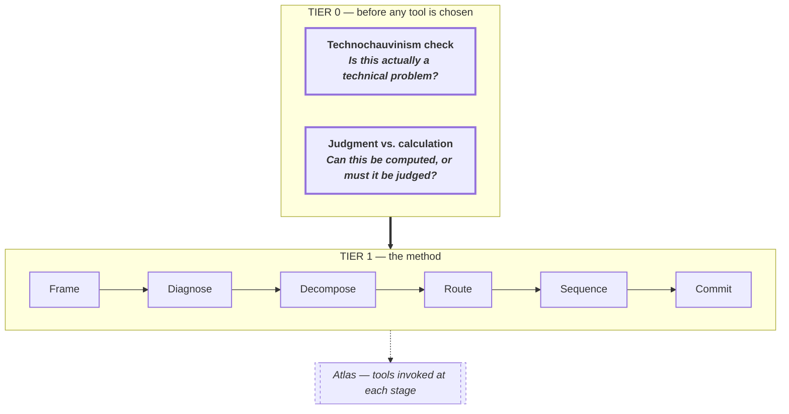

# Chapter 1 — The agentic shift

## 1.1 The question that ended

The question is not whether to use AI. That debate ended. The question is what job now needs a human in it.

Three jobs remain. Frame the problem. Decide when a machine should not be in the loop. Carry responsibility for the outcome. Everything else — summaries, first-pass analysis, meeting notes, boilerplate — has moved or is moving. This book is about the work that stayed.

It is organised around one claim: most of the value a person adds sits before any model is chosen. Problem framing, stakeholder routing, the decision about whether to automate at all — these are the places where judgment still earns its fee. The tools in the atlas support those decisions; they do not replace them.

A warning about the stance of this book. Two gates sit above every other decision in the method. The first asks whether we are reaching for a technical answer because the problem is technical, or because technical answers are what we know how to sell. The second asks whether the decision can be calculated, or must be judged. A calculated decision can be delegated to a model. A judged decision cannot, however much pressure there is to pretend otherwise. Skip those two gates and the rest of the method still runs — in service of the wrong goal.

## 1.2 What actually changed

The middle dropped out. That is the shortest honest account of the last three years.

Tasks that used to absorb an afternoon — drafting a memo, summarising a deposition, writing a first-pass regression, producing a slide outline, triaging a support queue — now take minutes. Not because they became easier. Because a different actor does them. Anthropic's December 2024 work on agentic patterns and its 2025 follow-ups on context engineering, long-running harnesses, and multi-agent research systems describe the same trajectory from inside the tooling: more of the workflow now runs in machine-machine loops, with humans at the ends. Plan-and-execute, orchestrator-worker, evaluator-optimiser — these are the design patterns of the middle layer, and they are the middle layer that used to be someone's job.

What moved. Summary. Synthesis of long documents. Boilerplate generation. First-pass code. First-pass analysis. Translation. Routine drafting. Schedule arithmetic. Comparative research. The kind of work a junior person used to produce so a senior person could react to it. That loop is now mostly inside a model.

What did not move. Three things, in order of how often they are confused for each other.

The first is **framing**. Deciding what the problem actually is. Deciding who it is a problem for. Deciding what would count as having solved it. A model given a badly framed problem produces a confident, well-written, wrong answer faster than any human could. Framing is not a bottleneck that better tooling will widen. It is the act that decides what the tooling is pointed at.

The second is **judgment**. Weizenbaum drew this line in 1976 and it has held up better than almost anything else in the AI literature. Some decisions have a right answer that computation could in principle reach — optimal packing, shortest route, tax liability given a clean return. Others do not. What a sentence should be. Whether a parent loses custody. Whether this patient's remaining months are better spent on treatment or on going home. These are decisions about what kind of world to live in. They look like decisions, but they are not calculations, and the category error of treating them as calculations is the single oldest hazard in this field.

The third is **accountability**. Someone signs. Someone carries the outcome. Models do not. Vendors do not, contractually. Organisations carry reputational risk but not personal risk. The named owner — a human whose career moves with the decision — is still how consequence attaches. This is not sentimental. It is what keeps the feedback loop closed. When a system fails and no one's name is on the failure, the organisation learns nothing. Another version of the same system will be built next year, by someone who also did not sign.

A caveat about "what stayed". The three are not fixed job descriptions. They are three acts that keep recurring in every engagement, and they recur at higher density than they used to, because the work between them has collapsed. The framing conversation used to be the opening ten minutes of a three-month project. It is now most of week one. The accountability conversation used to happen at sign-off. It now has to happen at the routing gate, because by sign-off the system has already been running in production for a month.

Two footnotes to "what changed", because forecasting is not the business of this book.

No prediction here about which model or vendor wins. The method is model-agnostic. If the frontier names change in eighteen months — and they will — the routing decisions in later chapters do not. They sit above the tool.

No prediction about capability curves. The method is written for the present. Some of the Tier-0 gates are written so they survive capability improvements — Weizenbaum's line holds whether or not a model can compute the judged decision, because the objection was never that the machine could not do it. The objection was that doing it was the wrong move.

The shift, then, is not that machines got more capable. It is that the interesting work moved earlier in the chain. Framing, routing, and carrying the outcome — work that used to be bundled into the middle of an engagement — is now most of the engagement. Everything downstream of those three acts runs fast. Everything upstream of them is where the method lives.

## 1.3 Two gates above the method

Before any of that, two checks. Call them Tier 0. They sit above the method, not inside it. Either one can stop an engagement cold. [Chapter 4](ch-4.md) teaches them properly, with worked examples; this is the announcement.

**Gate one. The Technochauvinism Check.** Broussard's term, from *Artificial Unintelligence* (2018) [verified]. The one-sentence test: is this a technical problem, or a social problem being renamed? Build the model anyway and the governance failure is automated at scale.

**Gate two. The Judgment-vs-Calculation Test.** Weizenbaum's distinction, from *Computer Power and Human Reason* (1976) [verified]. The one-sentence test: is there a right answer here that computation could in principle reach? If the decision is about what kind of world to live in, computing it is a category error, not a capability problem. The line does not dissolve with capability.

A third move, narrower, sits behind these. Dan McQuillan's *Resisting AI* (2022) [verified] argues that for certain decision categories — predictive policing, automated welfare sanctioning, immigration risk scoring — the honest recommendation is abolition, not better governance. The method has to be able to say that out loud. [Chapter 2](ch-2.md) clears that space.

For now: two gates, one referral. Nothing else in the method runs until they are answered. [Chapter 4](ch-4.md) carries the full treatment.

See Illustration 1.1.

*Illustration 1.1 — Two gates above the six-stage method. Emphasis on Tier-0 carried by heavier border and bold type, not hue.*

## 1.4 What this book covers, in order

Six stages. They run in the order an engagement runs.

**Frame.** State what the work is, what success means, and who the success is for. Tier 0 lives here. If framing takes a day, that is a fast day. If it takes a week, that is a cheap week.

**Diagnose.** Observe before triage. Most briefs arrive pre-diagnosed by someone who wanted to skip the observing. The work is to un-diagnose them, look at what is actually happening, and write a short situation statement the rest of the method runs on.

**Decompose.** Break the problem into pieces that can be routed separately. The pieces matter more than the decomposition frame — but the frame decides what pieces you see. Pyramid, MECE, issue trees, JTBD, Ishikawa, 5 Whys, fault trees. The chapter walks the family.

**Route.** Place each piece. Human. Rules. Statistics. Classical ML. LLM feature. Retrieval-augmented. Single agent. Tool-using agent. Multi-agent. Most expensive mistake in the method is here. A piece routed one rung too high — a rule dressed up as a classifier, a classifier dressed up as an agent — carries its mismatch for the life of the system.

**Sequence.** Given the routing, decide the order. Dependencies. Reversibility. Blast radius if something fails. A pilot before a staged rollout before a full deployment, and triggers for rollback at each step.

**Commit.** Name an owner. A commitment without a named owner is a wish. Diffuse ownership is the most common governance failure this book will name.

After the six stages, the book adds three views on top. Three access indices — task codifiability, weight class, starting point — help decide how a given problem should enter the method. Ten cross-cutting overlays — data readiness, evals-as-code, rung-indexed total cost, three-stage rollout, the adaptation tree, the privacy ladder, the NIST plus ISO governance spine, the retirement protocol, HAX / PAIR / Shneiderman, data contracts — sit across all six stages. Five governance failure modes name how the method can be run cleanly and still produce harm.

Then the atlas. Twenty-six tools. Each entry is a single reference card: what the tool is, where it came from, what it is for, what it fails at, when not to use it. Tools are held back until [Chapter 8](ch-8.md) because routing errors swamp tool-choice errors. Choose the right rung, then choose the tool on that rung. Not the other way around. The common failure pattern is to start from a tool — a retrieval stack someone liked, a multi-agent framework someone demoed — and work backwards to a problem shaped like the tool. That is how a rules problem becomes a retrieval problem, how a retrieval problem becomes an agent problem, and how a perfectly good engagement ends up paying frontier-model prices to do what a decision table would have done for free.

That is the whole shape. Six stages. Three indices. Ten overlays. Five failure modes. Twenty-six tools. Two gates above all of it.

## 1.5 A word on discipline

Two disciplines hold the rest of the manuscript honest.

The first is reference. Every cited source carries a tag on first mention: verified, partial, secondary, vendor-origin, pre-canonical, single-author. Where an idea is misattributed, the provenance is stated in-line. MECE is often attributed to Minto; she traced the logic to Aristotle. Five Whys is attributed to Ohno; he credited Sakichi Toyoda. Jobs-to-be-Done is attributed to Christensen; the operational form is Ulwick's. Small repairs, made visible. The point is not pedantry. It is that a book that invites consequential decisions has to show its working.

The second is voice. Short paragraphs. One claim at a time. The work is named, not the worker — no "the consultant", no "the decision-maker", no "the practitioner". No role label is needed to know when the book is talking to you. Where the evidence supports a recommendation, I make it. Where it does not, I say so. You will not find the word *leverage* in what follows.

The door is open. Next, what the book is about.

## Sources

- **[verified]** Broussard, M. (2018). *Artificial Unintelligence: How Computers Misunderstand the World*. MIT Press.
- **[verified]** Weizenbaum, J. (1976). *Computer Power and Human Reason: From Judgment to Calculation*. W. H. Freeman.
- **[verified]** McQuillan, D. (2022). *Resisting AI: An Anti-fascist Approach to Artificial Intelligence*. Bristol University Press.
- **[verified]** Anthropic (2024). *Building Effective Agents*.
- **[verified]** Anthropic (2025). *Effective Context Engineering for AI Agents*.
- **[secondary]** Minto, B. (1987). *The Pyramid Principle*. Pitman.
- **[secondary]** Ohno, T. (1988). *Toyota Production System: Beyond Large-Scale Production*. Productivity Press.
- **[verified]** Ulwick, A. (2005). *What Customers Want*. McGraw-Hill.
