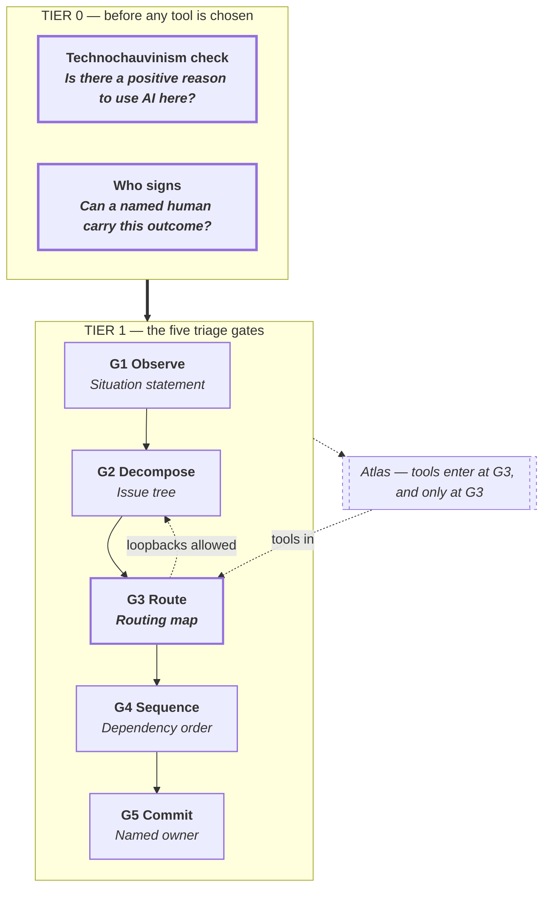

# Chapter 3 — The method at a glance

The entire method fits on one page. This chapter is that page, expanded.

What follows is the whole shape of the book, walked at a slow pace. Two gates sit above the method. Five gates sit inside it. A toolbox hangs below. Three indices and ten overlays stand to the side. Every later chapter does one of these things in more detail; nothing is added that is not shown here first.

## 3.1 The method on one page

See Illustration 3.1.

*Illustration 3.1 — The method at a glance. Two Tier-0 gates sit above five Tier-1 gates. The atlas enters at G3 only. Loopbacks from G3 back to G2 are cheap and expected.*

The top band holds the two Tier 0 gates. The row below it is Tier 1 — the five triage gates, left to right, in the order they run. Below the row is the atlas strip, where every tool enters the method at G3. To each side are quiet rails pointing to the three access indices and the ten overlays. Those are for later. The method itself runs without them.

The illustration shows the whole shape of the method; nothing else is being revealed on the page.

## 3.2 Tier 0 — the two gates

Two gates stand above the method. They are not refinements of it. They decide whether the method runs at all.

The first gate is the **Technochauvinism Check** (Broussard, 2018) [verified]: is this a technical problem at all, or a social problem renamed? Both answers are valid; the gate forces the question to be asked before a tool is reached for.

The second gate is **Who Signs** — a signature test descended from Weizenbaum's *Computer Power and Human Reason* (1976) [verified], stripped of its capability claim. The one-sentence test: can a named human actually carry the outcome of this decision? Weizenbaum's original argument mixed two claims — that machines could not compute certain decisions, and that they should not. The empirical half has not survived the last decade; a modern model can produce sentencing-style reasoning, therapy-style dialogue, custody-style weighing. The moral half has. When a signature dissolves into a vendor, a committee, or a model, the feedback loop breaks and the accountability that gave the category its moral weight disappears. The gate turns on that — not on what the machine can compute.

The effect on the method is simple. Everything else waits. Tier 1 does not open until both gates have been answered, and the two gates produce four outcomes: abolish the automation category entirely (rare, documented in McQuillan 2022 [verified]); redirect to a non-technical fix; retain the human and use AI in an advisory role only; or proceed. Only the last opens the door to Tier 1.

[Chapter 4](ch-4.md) carries the full treatment — the worked examples, the escalation paths, the rooms in which each gate is asked.

A word on the two views. Illustration 1.1 shows six stages: Frame → Diagnose → Decompose → Route → Sequence → Commit. Illustrations 3.1 and 6.1 collapse Frame and Diagnose into a single gate called **Observe**, producing a five-gate triage view. Both are the same method viewed at two altitudes. The six-stage view is the book's spine and structures Part 2. The five-gate view is the working altitude for the 30-minute triage session [Chapter 6](ch-6.md) teaches, where Frame and Diagnose happen inside one conversation.

## 3.3 Tier 1 — the five triage gates

Inside the method, five gates run in order. Each gate has a name, one question, and one artefact it produces. Nothing more.

**G1 Observe.** What is actually happening? Most briefs arrive pre-diagnosed by the person writing the brief. G1 undoes that. It goes to the work — the operator's desk, the queue, the actual customer call — and writes down what is happening in the operator's or the customer's words, not the sponsor's. The output is a short paragraph: what is happening, to whom, since when, with what second-order effects, what changed recently. This paragraph is the **situation statement**. It is the only artefact G1 produces. Hammer's 1990 [verified] warning about automating the cow-path applies here: you cannot route a problem you have not seen.

**G2 Decompose.** Independent pieces, or one tangled thing? G2 takes the situation statement and breaks it into pieces that can be routed separately. The backbone is Minto's pyramid and its MECE discipline — mutually exclusive, collectively exhaustive. Specialist frames sit under the backbone: Ishikawa (1943) [verified] for multi-cause brainstorms; 5 Whys, attributed via Ohno (1988) [secondary] to Sakichi Toyoda, for simple chains; Ulwick's operational Jobs-to-be-Done (2005) [verified] when the shape of a solution is unknown; fault trees when failure is safety-critical. The output is an **issue tree**: the problem as a set of independent sub-problems, each small enough to route.

**G3 Route.** Where does each piece belong? This is the gate most engagements fail at. Given the pieces from G2, each piece is placed against the right computational substrate — a rule, a statistical model, classical ML, an LLM feature, retrieval-augmented generation, a single agent, a tool-using agent, a multi-agent system — or handed back to a human. The default is *not agentic*. Each sub-problem needs a positive case to be routed above rules or statistics. The output is a **routing map**: each piece with its destination named and justified. Tools enter the method here and only here. The atlas is the reference.

**G4 Sequence.** In what order, given dependencies? G4 draws the dependency graph across the routed pieces. Three lenses read the graph: what depends on what; what is reversible and what is not; what the blast radius is if a piece fails. A piece that is irreversible and high-blast-radius runs last, behind a shadow-mode pilot and a staged rollout. A piece that is reversible and contained can run first, even if it is the larger piece. The output is a **dependency order** — a numbered sequence with reversibility and blast-radius notes attached.

**G5 Commit.** Who carries the decision? A commitment without a named owner is not a commitment. G5 names one person — not a committee, not a role, not a rotating seat — who owns the outcome, controls the resources to change course, and signs the rollback triggers. The output is a one-page document: owner, triggers for rollback, review cadence, sunset criteria. If the gate cannot produce that page with a real name on it, the engagement does not cross into implementation.

The five gates run in order, but they are not one-way. The arc on Illustration 3.1 from G3 back to G2 is doing real work. Routing often discovers that the decomposition was wrong — a piece that looked independent turns out to share a data pipeline with another, or a piece that looked routable to rules turns out to hide a judgment. When this happens, the loopback is cheap. Pretending it did not happen is expensive.

## 3.4 Tools enter at G3

The atlas comes in at G3 and not before. This is a deliberate ordering, and it is worth one paragraph of defence.

Routing errors swamp tool-choice errors. A correctly chosen LLM, pointed at the wrong sub-problem, produces a well-evaluated answer to a question nobody asked. A correctly framed sub-problem, pointed at an imperfect tool, produces a close-to-right answer that a human can repair. The first is expensive to detect and more expensive to fix. The second is visible and cheap. The method holds tools back until G3 because the cost of a wrong tool is bounded by the cost of replacing the tool; the cost of a wrong route is bounded by the size of the engagement.

The five most common routing errors sit together because they are variants of the same mistake: choosing a tool before the routing is clear. Promoting a rule-based piece to an LLM because LLMs are newer. Demoting a judgment piece to a classifier because the classifier performs well on the training distribution. Reaching for an agent when a single function call would do. Routing to classical ML without a label budget. Routing to retrieval-augmented generation when the knowledge base is not retrievable-quality yet. The atlas entries for each of these tools say this in the *when not to use* section. [Chapter 8](ch-8.md) treats them one by one.

The atlas itself is not a glossary. Every entry follows the same eight-section template: purpose, anatomy, example, pitfalls, when not to use, provenance, related tools, verification tag. Twenty-six tools recur across the method. They are the toolbox — no more, no fewer.

## 3.5 Overlays and indices

Two quiet bands sit to the side of the main method. Most engagements do not need them on first pass. Large or regulated engagements cannot function without them.

On one side are the three **access indices** — the subject of [Chapter 10](ch-10.md). They help decide where a problem enters the method. The first index is **task codifiability**: a spectrum from tasks with explicit rules or labelable outcomes (payroll) to tasks that rely on judgment (settling a contested divorce). The second is **weight class**: featherweight tools (a 5 Whys takes minutes) to industrial programmes (ISO 42001 certification takes months). The third is **starting points** — a catalogue of eight common entries into an engagement, from a new build to an incident review to a compliance mandate. A problem triaged through all three indices arrives at G1 with its rough shape already named.

On the other side sit the ten **cross-cutting overlays** — the subject of [Chapter 11](ch-11.md). Each overlay is a discipline that most teams re-invent badly and that runs across the whole method rather than living at one gate. The ten are: a data readiness gate; evals-as-code; rung-indexed total cost of ownership (the published agent-multiplier figure is roughly ten to twenty times a single LLM call); a three-stage rollout pattern (shadow, canary, progressive); an adaptation decision tree (prompt, then retrieval, then fine-tune, then agent, in that order, with stop rules); a privacy control ladder; the NIST and ISO governance spine; a retirement protocol; the interaction-design stack (HAX, PAIR, Shneiderman's two-dimensional human-centred AI frame); and data contracts. Each overlay has a home chapter or atlas entry.

A closing note on scope. The indices and overlays are the reason this is a 220-page book and not a 40-page pamphlet. They hold the method up under realistic conditions — regulated industries, messy data, governance regimes, long time horizons. They are for later use. The method runs without them.

## 3.6 How the rest of the book is shaped

Part 2 teaches the gates. One chapter per gate or pair of gates: frame, diagnose, decompose, route, sequence and commit. The gates are taught in the order the method runs. Part 2 is the book's spine.

Part 3 adds the views that sit across the method: the three access indices, the ten overlays, the five governance failure modes, and a chapter on retirement — what to stop doing. Part 3 is where the method meets realistic conditions.

Part 4 is the atlas. Twenty-six tool entries, each in the same template. Read once in order if you have never met the tools before. Thereafter, look up entries on demand.

Front matter and back matter are thin. A preface, a reader's guide, a glossary, and a compiled sources list. They earn their space by being short.

[Chapter 4](ch-4.md) opens Part 2 with Frame — the first Tier-1 stage. Tier 0 sits above all six stages and is treated in Chapter 4 alongside Frame, because the framing conversation is where the Tier-0 gates are actually run.

## Sources

- **[verified]** Broussard, M. (2018). *Artificial Unintelligence: How Computers Misunderstand the World*. MIT Press.
- **[verified]** Weizenbaum, J. (1976). *Computer Power and Human Reason: From Judgment to Calculation*. W. H. Freeman.
- **[verified]** McQuillan, D. (2022). *Resisting AI: An Anti-fascist Approach to Artificial Intelligence*. Bristol University Press.
- **[verified]** Minto, B. (1987). *The Pyramid Principle: Logic in Writing, Thinking and Problem Solving*. Pitman.
- **[verified]** Ishikawa, K. (1943 diagram; 1968 Japanese / 1976 English). *Guide to Quality Control*. Asian Productivity Organization.
- **[secondary]** Ohno, T. (1988). *Toyota Production System: Beyond Large-Scale Production*. Productivity Press.
- **[verified]** Ulwick, A. (2005). *What Customers Want*. McGraw-Hill.
- **[verified]** Hammer, M. (1990). "Reengineering Work: Don't Automate, Obliterate." *Harvard Business Review*, July–August 1990.
- **[verified]** Lewis, P. et al. (2020). "Retrieval-Augmented Generation for Knowledge-Intensive NLP Tasks." *NeurIPS 2020* / arXiv 2005.11401.
- **[verified]** NIST (2023). *AI Risk Management Framework 1.0* (NIST AI 100-1).
- **[verified]** ISO/IEC 42001:2023. *Information technology — Artificial intelligence — Management system*.
- **[verified]** Amershi, S. et al. (2019). "Guidelines for Human-AI Interaction." *Proc. CHI 2019*. DOI 10.1145/3290605.3300233.
- **[verified]** Shneiderman, B. (2022). *Human-Centered AI*. Oxford University Press.
