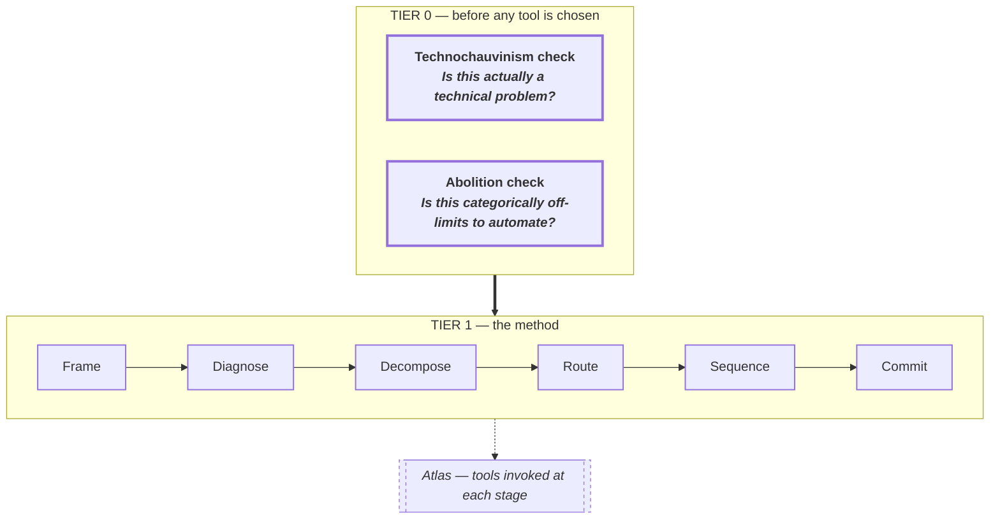

# Illustration 1.1 — Two gates above the method

Referenced in Chapter 1. Monochrome: black lines on white in light mode, inverted in dark mode. Emphasis on Tier-0 comes from heavier borders and double-weight rules, not colour.

Encoding:

- Tier-0 gates — **3-pixel border** and bold type. Heavier border reads as gating.
- Tier-1 stages — standard border, standard weight. A sequence without visual drama.
- Atlas strip — dashed border, italic, reads as *ancillary*.
- Band arrow (Tier 0 → Tier 1) — thick (`==>`). Stage-to-stage arrows (within the spine) — normal. The band-to-band transition is the one emphasis in the diagram; everything else recedes.

## What the house rule buys

Switch dark mode on (top right). The whole diagram inverts to white-on-black without a second asset. The emphasis reads the same in both modes because it lives in weight and stroke, not hue.

## Where monochrome pushes back

Mermaid's default theme uses pale blues; we override via `themeVariables` to force fg/bg to pure fg/bg. If a future illustration needs a third visual layer (e.g. a deprecated vs current distinction that affects half the nodes), the spec will say so and justify adding one accent colour.

## Tradeoff summary

| Dimension | Notes |
|---|---|
| Editing cost | Very low — one Mermaid fence |
| Visual control | Weight, stroke, dash — no colour |
| Theme swap | Automatic (CSS variables + `MutationObserver` re-render) |
| Print / PDF | Yes — pure monochrome is print-ideal |
| Third colour | Only with written justification in the spec |
